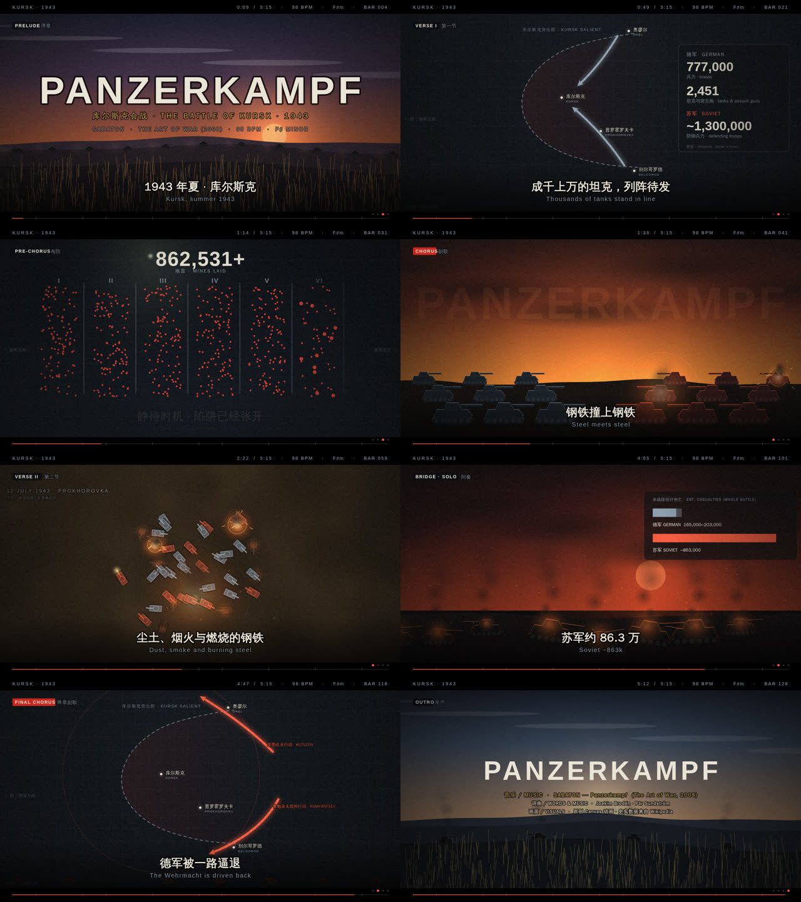

# Panzerkampf · 库尔斯克 1943 —— 前端音乐 MV

为 Sabaton 的 **Panzerkampf**（专辑 *The Art of War*，2008）制作的纯前端 MV：一个 `index.html`，Canvas 绘制，无任何依赖。

## 怎么用

直接用浏览器打开 `index.html`（或 `npx http-server panzerkampf-mv`）。

| 操作 | 说明 |
| --- | --- |
| **开始播放** | 使用页面内置的**原创**简易合成节拍（98 BPM · F♯ 小调）驱动画面，没有音频文件也能看完整 5:16 |
| **载入音频** | 选择（或把文件拖进窗口）你自己合法获得的 Panzerkampf 音频，画面按真实低频鼓点律动、爆炸 / 冲击波跟着鼓点走 |
| `空格` · `←` `→` · `R` · `F` | 播放暂停 · 快退快进 5 秒 · 从头播放 · 全屏 |
| `[` `]` | 载入真实音频后，整体微调音画同步（±0.1 秒） |
| **● 录制 WebM** | 从头完整播放并把画面 + 声音录成 `panzerkampf-mv.webm` 自动下载（实时录制，需 5 分 16 秒） |

> **版权说明**：本仓库不包含 Sabaton 的音频，也不逐字复制歌词。屏幕字幕是根据公开资料**自行改写的叙事说明**，不是歌词。

## 歌词分析

**主题与视角**：歌曲讲述 1943 年夏的**库尔斯克会战**（德方代号“堡垒行动”，Operation Citadel），**以苏联一方的视角**叙述；这是德军在东线的最后一次大规模攻势。资料明确指出歌曲既不美化战争，也不美化纳粹，应视为一首历史叙事作品。词：Joakim Brodén、Pär Sundström；曲：Joakim Brodén。

**叙事弧线**（按公开的歌词释义概括，不引用原句）：

1. **集结** —— 开篇交代规模：成千上万的坦克列阵，德军攻势的体量扑面而来。
2. **布防** —— 苏军在夜色中布雷、构筑纵深防线，静待时机；德军一头撞进了对方设好的陷阱。
3. **对决** —— 重心落在普罗霍罗夫卡原野（7 月 12 日），装甲兵团近距离厮杀，双方损失惨重。
4. **逆转** —— 德军攻势受阻，战局转向苏军一侧，德军被逐步击退。

**意象**：钢铁 / 履带 / 地雷 / 夜晚 / 原野 —— 全是“重”和“暗”的东西，几乎没有抒情性的比喻，更像一份被唱出来的战报。

**史实锚点**（用于画面中的数字，来自 Wikipedia *Battle of Kursk*）：1943-07-05 战役开始；德军约 77.7 万人、2,451 辆坦克与突击炮；苏军 6 道防线、纵深 130–150 公里、94.3 万余枚地雷、约 130 万防御兵力；7-12 普罗霍罗夫卡 / 库图佐夫行动；8-03 鲁勉采夫统帅行动；8-23 战役结束；全战役估计伤亡德军 16.5–20.3 万、苏军约 86.3 万。

## 音乐分析

| 项目 | 数据 |
| --- | --- |
| 专辑 / 曲序 | *The Art of War*（2008）第 9 首；该专辑以《孙子兵法》各章为概念骨架 |
| 时长 | 约 5:15–5:16 |
| 速度 | **98 BPM**（也可按 196 BPM 的双倍速感受） |
| 调性 / 拍号 | **F♯ 小调** · 4/4 |
| 风格 | 力量金属（Power Metal），2007-09 至 2008-01 录于瑞典 The Abyss 录音室 |

> BPM / 调性来自 GetSongBPM、SongBPM、Tunebat 等站点的算法检测，可能有偏差。

**我的解读与画面转译**

- **98 BPM 的中速“行军”**：不是疾驰，而是履带碾过地面的重量感 → 画面用缓慢、沉重的推进（坦克纵队、渐进的地图箭头、一格一格填满的雷场）。
- **小调 + 低沉的基调** → 配色取冷钢蓝灰做底，血红 / 铁锈橙做强调；苏军一方用红，德军一方用钢灰。
- **鼓点驱动**：每个强拍触发炮口火光、爆炸与屏幕微震；副歌起拍加一次全屏闪光。
- **力量金属的“主歌—副歌”对比**：主歌放“信息型”画面（地图、数字、雷场），副歌放“冲击型”画面（正面对撞）。

## 时间线（估算）

按 98 BPM、4/4、共 129 小节 ≈ 5:16 划分。**段落边界是根据歌曲结构估算的，并未逐帧对齐原曲**；载入真实音频后如觉得不齐，用 `[` `]` 微调，或直接改 `index.html` 里的 `SECTIONS`（每段的小节数）。

| 小节 | 时间 | 段落 | 场景 |
| --- | --- | --- | --- |
| 1–8 | 0:00 | 序章 | 黄昏草原 + 远处装甲纵队，标题 |
| 9–24 | 0:20 | 主歌 I | 战区示意图：南北钳形攻势，兵力数字滚动 |
| 25–32 | 0:59 | 预副歌 | 夜间布雷：6 道防线逐条填满地雷，计数器上升 |
| 33–48 | 1:18 | 副歌 | 两排坦克对射，爆炸 / 冲击波随鼓点 |
| 49–72 | 1:58 | 主歌 II + 转折 | 普罗霍罗夫卡俯视混战：履带印、爆炸、残骸与浓烟 |
| 73–88 | 2:56 | 副歌 | 同上，加强版 |
| 89–104 | 3:36 | 间奏 / 独奏 | 残骸、余烬、伤亡对比条形图 |
| 105–120 | 4:15 | 终章副歌 | 苏军反攻箭头，红色冲击波，装甲纵队向西 |
| 121–129 | 4:54 | 尾声 | 黎明，战役结束，字幕卡 |

## 局限

- 未能抓取到歌词全文（多个歌词站返回 403），歌词部分基于公开的释义摘要；逐句对口型 / 逐词卡拍不在范围内。
- 合成节拍只是“能听见节奏”的演示伴奏，并非原曲的复刻。
- 地图与坦克战场均为**示意**，不是精确的地理或兵力还原；画面中不使用任何军徽 / 国徽标志。

## 资料来源

- [Panzerkampf — Song Meanings and Facts](https://www.songmeaningsandfacts.com/panzerkampf-echoes-of-history-in-heavy-metal/)（歌词主题概述，经搜索结果摘要）
- [Panzerkampf - The Battle of Kursk (Sabaton History) — Metal Daze](https://www.metaldaze.eu/2022/11/panzerkampf-battle-of-kursk-sabaton.html)
- [The Art of War (Sabaton album) — Wikipedia](https://en.wikipedia.org/wiki/The_Art_of_War_(Sabaton_album))
- [Battle of Kursk — Wikipedia](https://en.wikipedia.org/wiki/Battle_of_Kursk)
- [Panzerkampf BPM / Key — SongBPM](https://songbpm.com/@sabaton/panzerkampf) · [GetSongBPM](https://getsongbpm.com/song/panzerkampf/xkKGO9)
